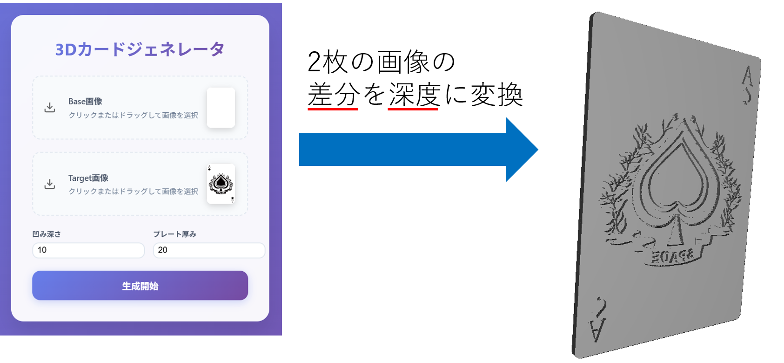

# 3Dカードジェネレータ

このプロジェクトは、画像をアップロードして3Dカードを生成するWebアプリケーションです。ユーザーは2つの画像をアップロードし、凹み深さやプレート厚みを調整して3Dモデル（STLファイル）を生成できます。


## 機能

- **画像アップロード**: ベース画像とターゲット画像をアップロード可能。
- **リアルタイムプレビュー**: アップロードした画像のプレビューを表示。
- **パラメータ調整**: 凹み深さやプレート厚みを調整可能。
- **3Dモデル生成**: STL形式の3Dモデルを生成してダウンロード。
- **プログレスバー**: 処理進捗を表示。

## 使用技術

- **フロントエンド**:
  - HTML5, CSS3
  - JavaScript (Vanilla JS)
- **バックエンド**:
  - Python (Flask)
  - ライブラリ: Pillow, NumPy
- **その他**:
  - STLファイル生成ロジック

## セットアップ

### 必要条件

- Python 3.8以上
- Flask
- Pillow
- NumPy

### インストール手順

1. リポジトリをクローンします。

   ```bash
   git clone https://github.com/your-repo/3d_card_generator.git
   cd 3d_card_generator